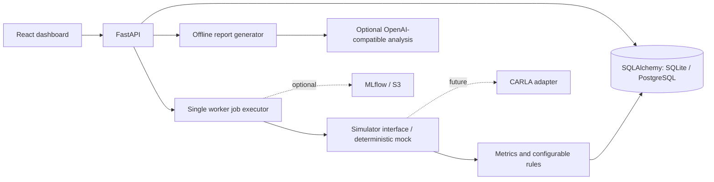

# Architecture and engineering scope

## Data and reproducibility

Scenario and AlgorithmVersion are independent records. SimulationRun references their IDs,
but also snapshots the resolved scenario configuration, rules, profile, tuning, artifact ID,
seed and simulator version. Scenario changes cannot retroactively alter a completed result.
TelemetrySample and EvaluationResult are typed, run-owned JSON documents rather than
separate relational tables; committing the completed run writes telemetry and evaluation
atomically. This keeps the portfolio deployment compact. For large datasets, move telemetry
to object storage and index summary metrics in relational columns.

Alembic owns schema changes. The initial revision adopts the original MVP tables; the
second adds snapshots and report persistence. Old runs retain their original results and
have empty provenance snapshots. Comparisons involving them warn about missing provenance.
SQLite is a source-checkout fallback; Compose uses PostgreSQL with a persistent volume.

## Job lifecycle

`POST /api/runs` validates and stores a queued record, then submits its ID to a single
in-process executor. The worker transitions to running, commits the start time, computes
telemetry outside a database transaction, then commits completed results or a failed state.
The queue has a best-effort 100-active-job guard. Status does not imply safety: a completed
job can have a failed evaluation. Fast mock jobs may finish before the first poll.

On process startup, unfinished records become failed with an interruption explanation;
the user can resubmit their saved scenario/configuration. There is no automatic replay.
Run exactly **one API process/replica**. Multiple replicas would incorrectly mark each
other's active jobs interrupted. For distributed deployment, replace the executor with a
persistent queue, leases and idempotent workers before scaling. Optional sinks execute
only after results commit; errors are logged without changing the result.

## Mock model and metrics

A seeded point-mass model integrates at 0.1-second intervals (a fractional final interval
supports arbitrary durations). Lane tests have no obstacle. Cut-in activates a moving
lead vehicle after one second; emergency braking decelerates the lead vehicle; stop-and-go
uses periodic traffic-dependent lead motion. Pedestrian and low-visibility cases use a
stationary conflict point; low visibility adds detection delay. These are illustrative
scenario mechanics, not a sensor/perception stack or a pedestrian dynamics model.

Rain and snow reduce braking and lane-correction grip. Fog, darkness and sensor noise
add latency; noise also perturbs steering/braking. Profiles have distinct reaction, braking
and lane gains; registered tuning multipliers alter those values. Collision terminates the
run and counts one contact event. No post-impact dynamics are modeled. Reaction time is the
first controller response after the hazard activates, or null if it never responds.

- TTC uses distance divided by positive closing speed; it is null when no obstacle exists
  or the gap is not closing. Collision TTC is zero. Null never means zero risk time.
- Deceleration is the positive magnitude of the strongest sampled deceleration.
- Average speed is time-weighted using trapezoidal integration.
- Speed violations count samples, not distinct episodes.
- Lane duration sums intervals whose initial sample is outside the configured boundary.
- Successful stop requires near-zero final speed, no collision and sufficient clearance.
  Stops are mandatory only for pedestrian, emergency-braking and low-visibility scenarios.
- Collisions and excessive lane deviation always fail. Critical TTC and speeding can be
  warning-only through explicit rules. An unfinished required stop fails.

The default campaign demonstrates both outcomes, not a statistically meaningful pass rate.
Changing simulator implementation may change seeded results: versioned snapshots identify
which model produced them. Mock outcomes cannot establish real ADAS release readiness.

## Reports and optional integrations

Offline reports preserve deterministic metrics, findings and sampled failure locations.
Selecting AI mode explicitly requests an external analysis of configuration and metrics.
The LLM cannot modify the pass/fail result. Credentials stay server-side; no telemetry
stream is sent. A provider timeout or invalid response retains the offline report.

`ResultSink` defines result publishing. MLflow logs seed/profile/scenario and scalar metrics;
S3 stores the complete synthetic result JSON. Install the appropriate Python extras and
configure environment variables. Both are optional and require separate service credentials.

## Deployment boundary

Compose binds the dashboard and API to localhost and keeps PostgreSQL private. The API has
no authentication, tenancy or authorization: it is a local portfolio deployment. Before a
public deployment, add identity/access controls, request limits, a durable job queue,
central secret management and database backups. Neither Docker nor a health check alone
makes it a production safety system. CI runs SQLite, PostgreSQL, UI workflow, build and
container health checks. The existing `automotiveECU/` C++ project is preserved independently.
